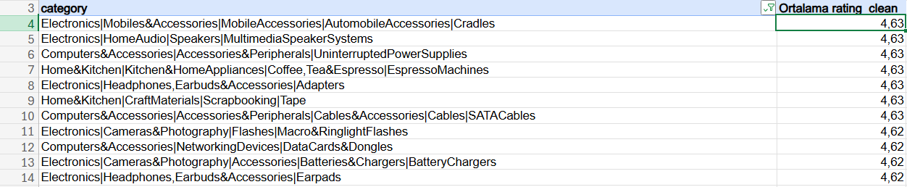
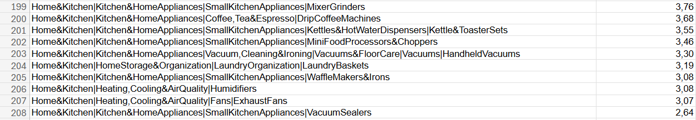
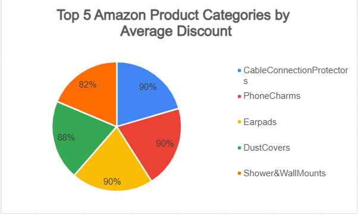
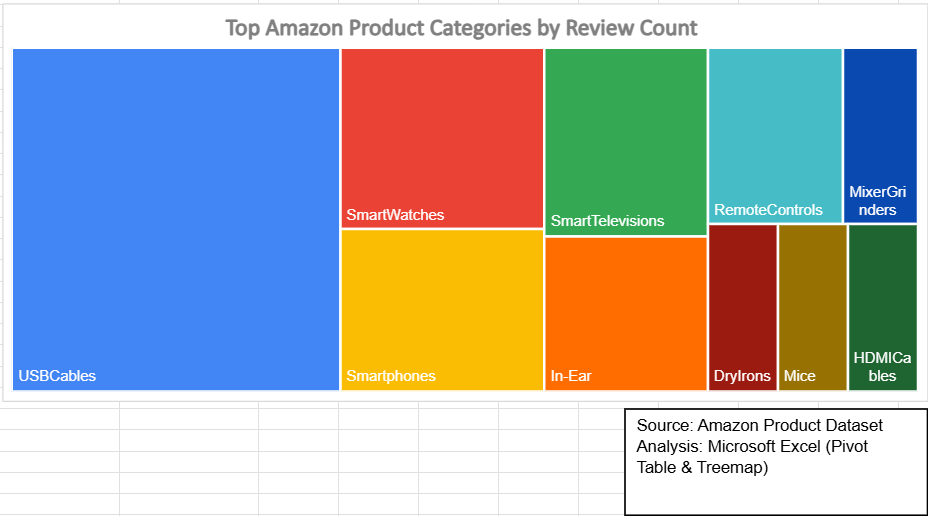
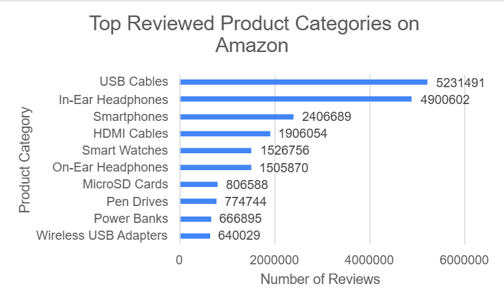

**This project demonstrates exploratory data analysis using Excel, SQL and Python on a real-world e-commerce dataset.**

# Amazon Product Data Analysis | Excel, SQL & Python
## Example Visualizations (EDA Results)
















## Overview

This project explores an **Amazon product dataset** to uncover insights about product ratings, customer reviews and pricing strategies.

The analysis was performed using **Excel, SQL and Python** to demonstrate different approaches to **exploratory data analysis (EDA)** and data visualization.

The goal of this project is to analyze customer satisfaction, product popularity and discount patterns across different Amazon product categories in order to better understand customer demand and pricing strategies in the Amazon marketplace.

---


## Dataset

The dataset used in this project contains Amazon product information including:

• Product category hierarchy  
• Product rating  
• Number of customer reviews  
• Discount percentage  
• Product pricing information  

The dataset was collected from publicly available Amazon product data and stored locally in this repository for analysis purposes.

File location:
dataset/amazon_products.csv

---


## Data Preparation

Before performing the analysis, the dataset was prepared and cleaned to ensure accurate results.

The following steps were applied:

• Checked the dataset structure and column types

• Converted rating values into numeric format for aggregation

• Grouped products by category hierarchy

• Removed potential inconsistencies in rating calculations

• Calculated aggregated metrics such as average rating, total reviews and average discount

These steps ensured the dataset was suitable for exploratory data analysis using Excel, SQL and Python.

---


## Business Questions

This project explores the Amazon product dataset to answer several key business questions:

• Which product categories have the highest customer satisfaction based on ratings?

• Which product categories receive the highest number of customer reviews?

• Which product categories offer the highest average discounts?

• Are there relationships between product popularity, ratings and discount strategies?

• Which categories might indicate potential quality issues based on lower ratings?

Answering these questions helps identify customer preferences, high demand products and pricing strategies used across Amazon product categories.

---
# Tools Used

The analysis in this project was conducted using the following tools:

- **Microsoft Excel** — pivot tables and charts for initial exploration  
- **SQL (MySQL / SQLite)** — querying and aggregating product data  
- **Python**
  - Pandas — data analysis
  - Matplotlib — data visualization
 
---


# Project Structure

The repository is organized into separate sections based on the analysis tools used.

```
amazon-product-data-analysis
│
├── dataset
│   └── amazon_products.csv
│
├── excel-analysis
│   └── Excel based data exploration and visualizations
│
├── sql-analysis
│   └── SQL queries used to analyze product categories, ratings and reviews
│
├── python-analysis
│   └── Python exploratory data analysis using Pandas and Matplotlib
```

---


# Analyses Performed

The following analyses were conducted across Excel, SQL and Python:

- Highest rated product categories  
- Lowest rated product categories  
- Product categories with the highest number of reviews  
- Product categories with the highest average discount  
- Most reviewed product categories  

These analyses help identify **popular product segments, pricing behavior and customer engagement patterns**.

---

# Key Insights

Some insights discovered during the analysis:

- Certain **electronics accessory categories** receive significantly higher review counts.  
- Categories with extremely high review volumes often represent **high demand products**.  
- Some product segments show **aggressive discount strategies**, indicating competitive markets.  
- Lower rated product categories may indicate **product quality or customer satisfaction issues**.

  These insights demonstrate how product ratings, customer engagement and discount strategies vary across different product segments on Amazon.

---

# Project Purpose

This project was created as part of a **data analysis portfolio** to demonstrate practical skills in:

- Data exploration  
- Data aggregation  
- SQL querying  
- Data visualization  
- Multi-tool data analysis workflows  

---


# Author

**Ebru İlhan**  
Computer Engineering Student at Karabük University  
Aspiring Data Analyst | SQL | Python | Data Visualization

GitHub:  
https://github.com/ebruilhan

https://www.linkedin.com/in/ebru-ilhan-3103b2341/
