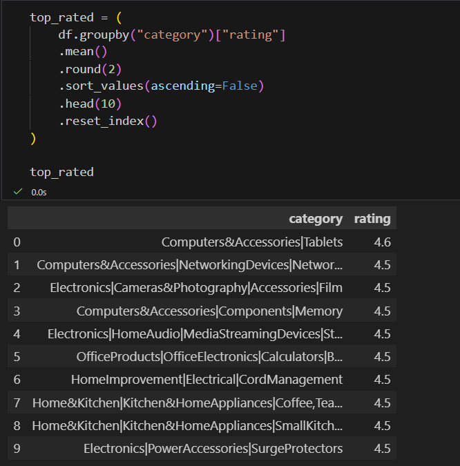
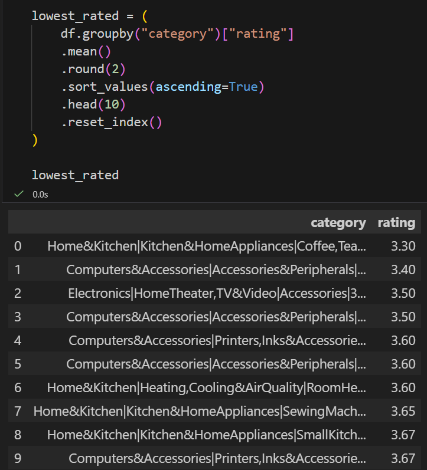
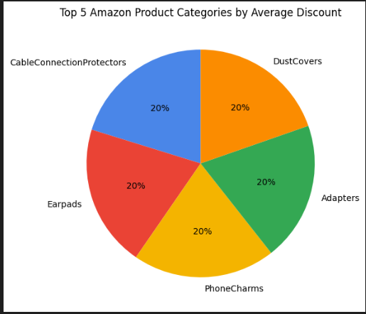
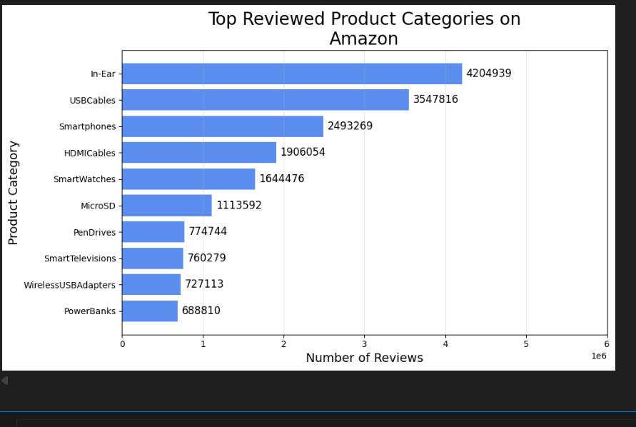
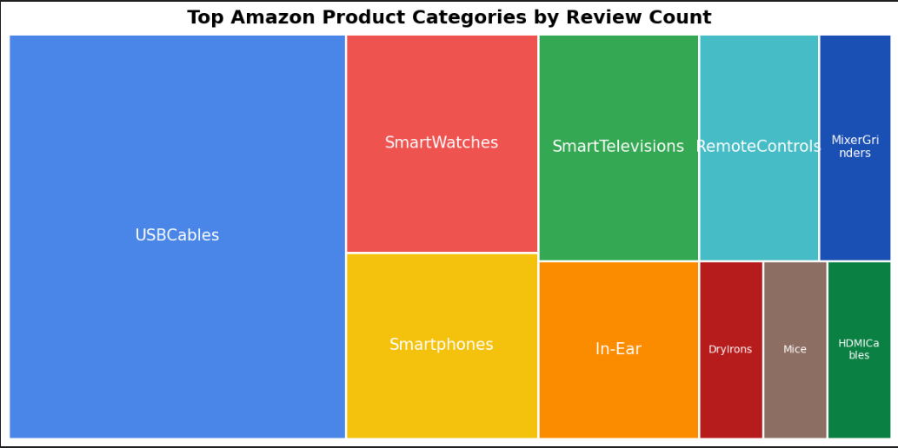

# Python Data Analysis

This section contains the Python-based analysis of the Amazon product dataset.

The analysis was performed using **Python, Pandas and Matplotlib** to explore patterns in product ratings, review counts and discount percentages.

## Analysis Steps

The following analyses were performed:

- Top rated product categories
- Lowest rated product categories
- Product categories with highest review counts
- Product categories with highest average discount
- Visualization of review distribution across categories

## Visualizations

### Top Rated Product Categories

### Lowest Rated Product Categories

### Top Categories by Average Discount

### Top Reviewed Categories

### Review Distribution Treemap

## Tools Used

- Python
- Pandas
- Matplotlib
