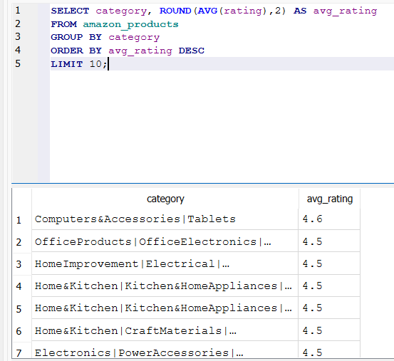
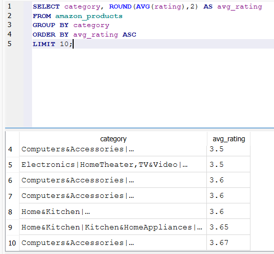
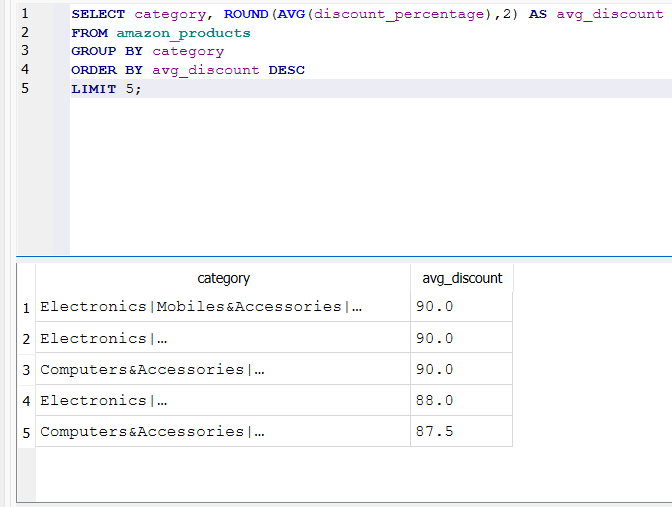
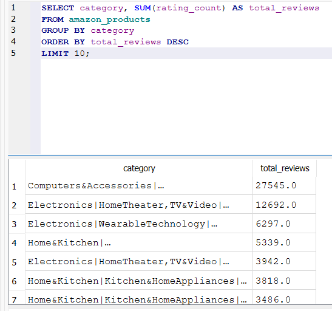
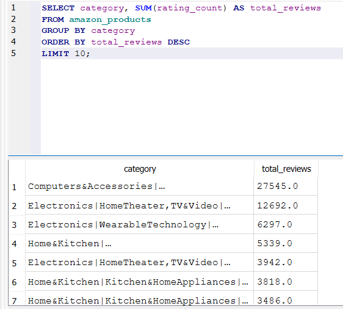

# SQL Data Analysis
This section contains SQL queries used to analyze the Amazon product dataset.
The analysis focuses on product ratings, customer reviews and discount patterns across different product categories.
The goal of this analysis is to extract insights about customer satisfaction, product popularity and pricing strategies.
The queries were written using SQL to explore relationships between product categories, ratings, review counts and discount percentages.

## Queries Performed
The following analyses were performed:

• Top rated product categories based on average rating

• Lowest rated product categories based on average rating

• Product categories with the highest average discount

• Product categories with the highest number of reviews

• Most reviewed product categories

## Results

### Highest Rated Product Categories

**Explanation**
This query calculates the average rating for each product category using the AVG() function.
The results are sorted in descending order to identify the categories with the highest customer satisfaction.
Categories with higher ratings typically indicate better product quality and stronger customer feedback.

### Lowest Rated Product Categories

**Explanation**
This query identifies the Amazon product categories with the lowest average ratings.
The dataset is grouped by product category and the average rating is calculated using the AVG() function.
The results are sorted in ascending order to highlight the categories with the lowest customer satisfaction.
These categories may indicate potential product quality issues or negative customer experiences.

### Categories with Highest Average Discount

**Explanation**
This analysis calculates the average discount percentage for each product category.
The query groups products by category and uses the AVG(discount_percentage) function to compute the average discount level.
The results are sorted from highest to lowest to identify categories where aggressive pricing or promotional strategies are most common.

### Categories with Highest Review Count

**Explanation**
This query determines which product categories have the highest total number of customer reviews.
The query uses the SUM(rating_count) function to calculate the total reviews for each category.
Categories with higher review counts usually represent high-demand products with strong customer engagement.

### Top Reviewed Categories

**Explanation**
This analysis highlights the most reviewed product categories on Amazon.
By summing the number of reviews for each category and sorting the results in descending order, we can identify product segments with the highest customer activity.
Categories with large review volumes typically indicate popular and frequently purchased products.
